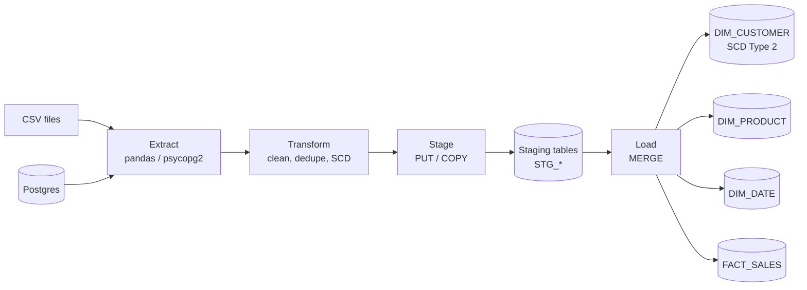

# Snowflake ETL Pipeline

A production-style ETL pipeline that loads data from CSV files and Postgres into Snowflake, replacing manual UI imports with an automated workflow covering extraction, cleaning, deduplication and dimensional modelling.

Built as a personal project to practise the patterns properly — staging tables, MERGE-based upserts, and a star schema with real slowly-changing-dimension handling rather than a flat dump.

## Architecture



## Star schema

| Table | Type | Notes |
|---|---|---|
| `DIM_CUSTOMER` | SCD Type 2 | Tracks email, address and segment changes over time via `effective_date`, `expiry_date` and `is_current` |
| `DIM_PRODUCT` | Overwrite | No history kept; product attributes are stable enough not to warrant it |
| `DIM_DATE` | Static | Pre-populated 2020–2026, includes Australian fiscal year and quarter |
| `FACT_SALES` | Fact | Grain is one row per order line item, referencing all three dimensions |

## Tech stack

Python · pandas · snowflake-connector-python · psycopg2 · pytest · SQL

## Setup

```bash
git clone https://github.com/Vikrant892/snowflake-etl-pipeline.git
cd snowflake-etl-pipeline
python -m venv venv
source venv/bin/activate        # venv\Scripts\activate on Windows
pip install -r requirements.txt
cp .env.example .env            # then fill in your Snowflake credentials
```

Create the schema by running these in a Snowflake worksheet, in order:

```sql
@sql/create_tables.sql   -- star schema DDL
@sql/staging.sql         -- staging tables and file format
```

## Usage

```bash
# Load from CSV
python -m etl.pipeline --source csv --file data/input/orders.csv --target orders

# Load from Postgres
python -m etl.pipeline --source postgres --table public.customers --target customers

# Upsert into the final table
python -m etl.pipeline --source csv --file data/input/customers.csv \
  --target customers --keys customer_id --merge

# Or via the wrapper script
./scripts/run_pipeline.sh csv data/input/orders.csv orders
```

Run the tests with `pytest tests/ -v`. Post-load data quality queries live in `sql/quality_checks.sql`.

## Project structure

```
config/settings.py       Snowflake and Postgres config from environment variables
etl/
├── extract.py           CSV reader, Postgres connector
├── transform.py         column cleaning, null handling, dedupe, SCD Type 2
├── load.py              Snowflake PUT/COPY, staging tables, MERGE
└── pipeline.py          orchestrator, ties E/T/L together with timing
sql/
├── create_tables.sql    star schema DDL
├── staging.sql          staging DDL and file format
└── quality_checks.sql   post-load data quality queries
tests/test_transform.py  unit tests for the transform layer
scripts/run_pipeline.sh  convenience wrapper
frontend/index.html      simple static view of the pipeline
```

## Snowflake gotchas worth knowing

Things that cost me real time while building this:

1. **Account identifier format.** Leave `.snowflakecomputing.com` off the account name — the connector appends it. Getting this wrong produces a confusing auth error rather than a clear one.

2. **PUT paths on Windows.** Use forward slashes even on Windows; the connector does not normalise backslashes, and the failure mode is a silent no-op rather than an error.

3. **NULL handling in COPY.** Snowflake treats empty strings and the literal `NULL` as different values. The `NULL_IF` list in the file format covers the common cases, but source data with its own null sentinels needs extra entries.

4. **SCD Type 2 does not scale in pandas.** The pandas-based SCD logic is fine up to roughly 500k dimension rows. Past that, the right move is pushing the SCD into Snowflake SQL using `MERGE` with window functions instead of doing the comparison in memory.

5. **Staging table lifecycle.** Staging tables are `CREATE OR REPLACE`d each run so they do not accumulate. `TRANSIENT` tables are the alternative if Time Travel storage cost matters more than recoverability.

6. **Date parsing.** The connector is strict about date formats. Parsing dates in Python before load is more predictable than fighting `TIMESTAMP_FORMAT` mismatches in the COPY.

## What I would do differently

- Orchestrate with Airflow or Prefect rather than cron plus shell scripts
- Run the quality checks as Snowflake tasks instead of manually
- Push failure notifications to Slack rather than relying on reading logs
- Move the transformation layer to dbt if the SQL logic grows

## Licence

MIT — see [LICENSE](LICENSE).
